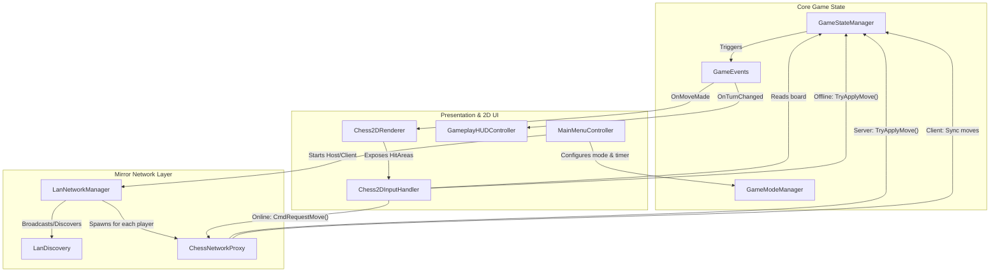
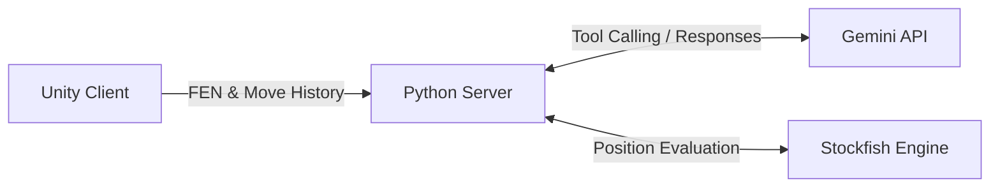

# ARChess
---
ARChess is a Unity mobile game that lets you play chess both in 2D and in 3D using AR technologies, while also offering AI-powered coaching for your matches.

## Overview & Features

- Play matches versus Stockfish, locally on the same phone versus another player or over a LAN
- Switch in-game from 2D mode to AR mode
- Get in-game feedback when playing against Stockfish or post-match reviews powered by Stockfish and Gemini.

## Backlog
To develop the game, my colleague and I used Jira to efficiently track individual tasks and to structure the work each person has to do.

### Kanban Examples
- [x] Pawn promotion, check alerts & end-game dialogs
- [x] 3D chess piece & board models
- [x] AR board placement & world anchoring

## Architecture

The application is structured into the Unity Game Client and the AI Python Server. 

### Game Client Architecture (Unity)

The client uses a modular architecture with a clear separation of concerns (Core Game State, Network, and Presentation layers):



### Server Architecture (Python FastAPI)

The backend acts as an intermediary, querying Gemini for natural language analysis and utilizing Stockfish for precise move evaluation.



- **Endpoints**:
  - `POST /analyze-move`: Used during live games (e.g., 1vsAI coaching) to deliver real-time feedback based on the current board state and recent moves.
  - `POST /review-game`: Called at the end of a match for a comprehensive full-match review.
- **Workflow**:
  1. The client sends the game state (FEN notation and move history) to the server.
  2. The server calls the Gemini API with the positional context and AI Tool definitions.
  3. When Gemini needs precise board evaluation, it invokes a defined Tool.
  4. The server runs Stockfish, calculates the score/best move, and returns it to Gemini.
  5. Gemini formulates readable, meaningful feedback.
  6. The server forwards this feedback text back to the Unity client.

## AI Agents
> [!NOTE]
> **AI integration**
> * We use `Gemini 3.1 Flash Lite` provided by two endpoints in our server for the game client to communicate with Google APIs.
> * We chose that model as a balance between its generous rate limits and its strong performance in generating feedback for the player.
> * Gemini's Python SDK provides an intuitive way of writing and defining tools for an AI Model, exchanging JSON objects for actual Python functions.

## Server & Game Setup
For the game client to provide full coaching capabilities, the server must be actively running on the local network.

### Prerequisites & Hosting

To set up the Python server locally, execute the following commands in the terminal (ensure you are inside the `server/` directory or reference it properly):

```bash
# 1. Create a Python virtual environment
python -m venv .venv

# 2. Activate the virtual environment
# On Linux / macOS:
source .venv/bin/activate
# On Windows (PowerShell):
# .\.venv\Scripts\Activate.ps1

# 3. Install required packages
pip install -r requirements.txt

# 4. Export your Gemini API Key
export GEMINI_API_KEY="your_api_key_here"  # macOS/Linux
# $env:GEMINI_API_KEY="your_api_key_here"  # Windows PowerShell

# 5. Run the server
uvicorn server:app --host 0.0.0.0 --port 8000
```

> **Note**: For the AI component to work, make sure the Stockfish engine is installed on the host machine. By default, the server expects Stockfish at `/usr/bin/stockfish`, but you can adjust this path in `server.py` (`STOCKFISH_PATH`) as needed.

**Testing the Server**:
Ensure that port `8000` is open on your host machine. You can quickly verify the server is running by accessing the Swagger UI from any device on your local network:
`http://<your-local-ip>:8000/docs`

### Play the game

To build the game APK, use Unity 6 and install the required packages provided in `/Packages`. If you want to get the game straight away, use the generated `.apk` file from GitHub Actions.

> [!WARNING]
> **AR Device Compatibility**
> To use the AR features, please ensure your phone supports ARCore by checking the [official Google Play Services for AR supported devices list](https://developers.google.com/ar/devices).

## Resources Used

-  **[Mirror](https://mirror-networking.com/)** — for LAN multiplayer
-  **[MagicaVoxel](https://ephtracy.github.io/)** — for 3D voxel modelling
-  **[ARCore](https://developers.google.com/ar)** — for powering the AR Mode
