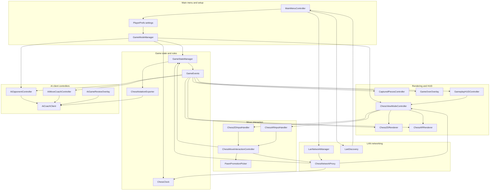
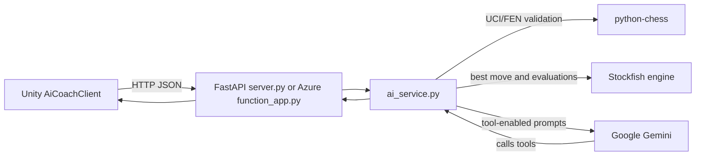

# ARChess Architecture

This document reflects the current repository structure. The application is split into a Unity game client and a Python AI service. The Unity client owns gameplay state and presentation; the service owns Stockfish/Gemini work.

## Unity Client

### Responsibilities

- `GameStateManager` is the single source of truth for chess state. It validates and applies legal moves, tracks timers, captures, move history, castling rights, en passant, repetition, and game-over state.
- `GameEvents` decouples rules from rendering, HUD, AI coach, and game-over UI.
- `ChessMoveInteractionController` centralizes board selection, highlighting, promotion, local move execution, and LAN routing. Both 2D and AR input adapters use it.
- `ChessViewModeController` switches between 2D and AR. It creates the AR session, XROrigin, camera, raycast/plane/anchor managers, renderer, and AR input handler at runtime.
- `ChessARRenderer` loads board and piece models from `Resources/ARModels`, builds square colliders/highlights, fits pieces to squares, and responds to game events.
- `LanNetworkManager` owns Mirror connection lifecycle, two-player admission, scene transition, color assignment, rematch, timer sync, and disconnect results.
- `ChessNetworkProxy` is the per-player Mirror bridge. It sends commands to the server, applies client RPC moves, handles target RPC startup, and rolls back rejected predicted moves.
- `AiCoachClient` posts JSON to the configured AI endpoint for live feedback, AI moves, and post-game reviews.

## Python AI Service

The canonical service is `server/`. `server.py` exposes a local FastAPI app and `function_app.py` exposes the same handlers as Azure Functions. Both share models and business logic in `ai_service.py`.

Current routes:

- `GET /health`
- `POST /ai-move`
- `POST /analyze-move`
- `POST /review-game`

`local_server/` is an older local prototype kept for reference. It is not the source of truth for the current Unity client.
