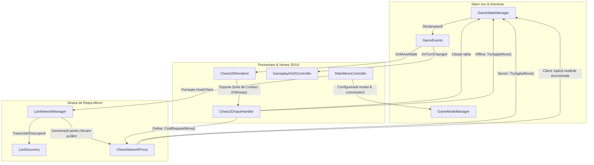

# Arhitectura AR Chess

Această diagramă ilustrează arhitectura de nivel înalt a aplicației AR Chess, arătând modul în care componentele majore interacționează între ele.

### Defalcarea componentelor
1. **Domeniul de Bază (Core)**: 
   - `GameStateManager` acționează ca unică sursă a adevărului pentru tabla de șah.
   - `GameEvents` oferă o modalitate decuplată pentru actualizarea elementelor vizuale atunci când starea se schimbă.
2. **Stratul de Rețea (Network)**: 
   - Construit folosind framework-ul Mirror, `LanNetworkManager` inițializează serverul/clientul.
   - `ChessNetworkProxy` rutează datele de intrare ale jucătorului către server și difuzează mutările verificate înapoi către clienți prin apeluri RPC.
3. **Prezentare (Presentation)**: 
   - `Chess2DRenderer` desenează interactiv sprite-urile pe baza `GameEvents`.
   - `Chess2DInputHandler` traduce evenimentele de pe ecran (touch/click) în mutări de șah.
