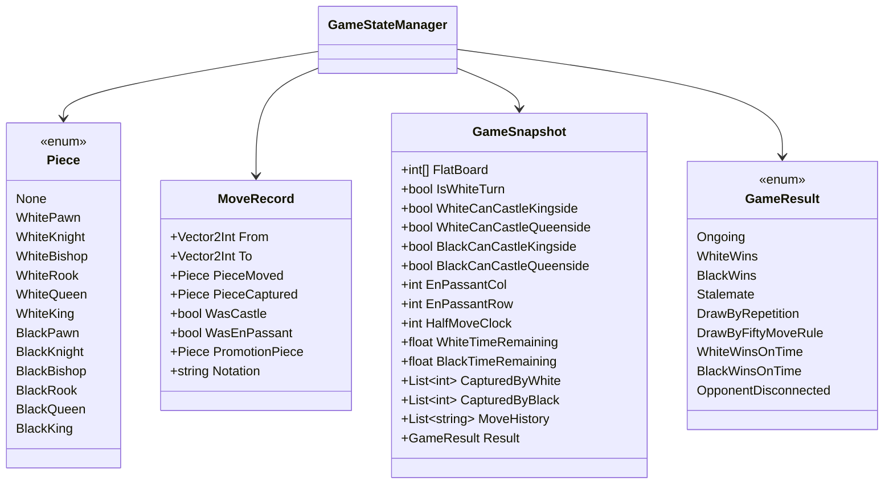

# ARChess Class Diagrams

The current Unity client is organized around a rules core, shared move interaction, view-specific render/input adapters, LAN networking, and AI service clients.

## Client Class Diagram

```mermaid
classDiagram
    class GameStateManager {
        +Piece[,] Board
        +bool IsWhiteTurn
        +bool IsNetworked
        +float WhiteTimeRemaining
        +float BlackTimeRemaining
        +List~MoveRecord~ MoveHistory
        +GameResult Result
        +InitBoard(float matchTimeSeconds)
        +TryApplyMove(Vector2Int from, Vector2Int to, Piece promotionChoice) bool
        +GetLegalMoves(Vector2Int from) List~Vector2Int~
        +TakeSnapshot() GameSnapshot
        +RestoreSnapshot(GameSnapshot snap)
        +ForceGameOver(GameResult result)
        +IsInCheck(bool white) bool
    }

    class GameEvents {
        <<static>>
        +OnMoveMade
        +OnGameOver
        +OnBoardReset
        +OnTurnChanged
    }

    class ChessNotationExporter {
        <<static>>
        +ToFen(GameStateManager gsm) string
        +GetMoveHistoryUci(GameStateManager gsm) List~string~
        +ToUci(MoveRecord move) string
        +BuildReviewRequest(GameStateManager gsm, string playerColor) AiGameReviewRequest
    }

    class GameModeManager {
        +GameMode CurrentMode
        +string LocalPlayerName
        +float TimerSeconds
        +string AiDifficulty
        +ExitCurrentGameToMainMenu()
        +SecondsFromPreset(string preset) float
    }

    class ChessClock {
        +StartClock(float secondsPerSide, bool isAuthority)
        +SetTimesFromServer(float whiteSeconds, float blackSeconds)
    }

    class ChessBoardRendererBase {
        <<abstract>>
        +Activate()
        +Deactivate()
        +SetPerspective(bool isWhite)
        +RedrawPieces()
        +ClearAllHighlights()
        +SetHighlight(Vector2Int square, Color color)
    }

    class Chess2DRenderer
    class ChessARRenderer {
        +bool IsPlaced
        +Vector2 BoardFootprint
        +PlaceBoard(Pose pose, Transform cameraTransform, ARAnchor anchor) bool
        +ClearPlacement()
        +RotateBoard(float degrees)
        +AdjustScale(float delta)
    }

    class ChessBoardInputBase {
        <<abstract>>
        +Activate()
        +Deactivate()
        +SetLocalPlayerIsWhite(bool isWhite)
        +SetLocalProxy(ChessNetworkProxy proxy)
    }

    class Chess2DInputHandler
    class ChessARInputHandler {
        +bool HasPlacedBoard
        +RepositionBoard()
        +ClearBoardPlacement()
        +RotateBoard(float degrees)
        +AdjustBoardScale(float delta)
    }

    class ChessMoveInteractionController {
        +SetContext(bool localPlayerIsWhite, ChessNetworkProxy proxy)
        +Activate()
        +Deactivate()
        +OnSquarePointerDown(Vector2Int square)
        +OnSquarePointerEnter(Vector2Int square)
        +OnSquarePointerUp(Vector2Int square)
        +RefreshBoardState()
    }

    class ChessViewModeController {
        +BoardViewMode CurrentViewMode
        +bool IsARSupported
        +bool CanToggleAR
        +ToggleARMode()
        +EnterARMode()
        +ExitARMode()
        +ConfigureMatchContext(bool isWhite, ChessNetworkProxy proxy)
        +RefreshAllViews()
    }

    class LanNetworkManager {
        +string HostPlayerName
        +float TimerSeconds
        +string gameSceneName
        +RequestRematch()
        +Disconnect()
        +NotifyClientSceneReady(NetworkConnectionToClient conn)
    }

    class LanDiscovery {
        +OnServerDiscovered
        +SendDiscoveryRequestTo(IPAddress address)
        +GetLikelyLanAddresses() IEnumerable~IPAddress~
    }

    class ChessNetworkProxy {
        +bool IsWhite
        +string PlayerName
        +CmdRequestMove(int fromRow, int fromCol, int toRow, int toCol, int promotionPiece)
        +TrySubmitPredictedLocalMove(Vector2Int from, Vector2Int to, Piece promotion) bool
        +TargetGameStarted(NetworkConnectionToClient conn, bool isWhite, float timerSeconds)
        +RpcApplyMove(int fromRow, int fromCol, int toRow, int toCol, int promotionPiece)
        +RpcTimerSync(float whiteSeconds, float blackSeconds)
    }

    class AiCoachClient {
        +AnalyzeMove(AiAnalyzeMoveRequest payload)
        +AiMove(AiMoveRequest payload)
        +ReviewGame(AiGameReviewRequest payload)
    }

    class AiOpponentController
    class AiMoveCoachController
    class AiGameReviewOverlay

    Chess2DRenderer --|> ChessBoardRendererBase
    ChessARRenderer --|> ChessBoardRendererBase
    Chess2DInputHandler --|> ChessBoardInputBase
    ChessARInputHandler --|> ChessBoardInputBase

    GameStateManager ..> GameEvents : raises
    ChessNotationExporter ..> GameStateManager : exports
    ChessClock --> GameStateManager : writes timers
    GameModeManager --> GameStateManager : initializes
    GameModeManager --> ChessClock : starts

    Chess2DInputHandler --> ChessMoveInteractionController
    ChessARInputHandler --> ChessMoveInteractionController
    ChessMoveInteractionController --> GameStateManager : local moves
    ChessMoveInteractionController --> ChessNetworkProxy : LAN moves
    ChessMoveInteractionController --> ChessBoardRendererBase : highlights

    ChessViewModeController o-- Chess2DRenderer
    ChessViewModeController o-- ChessARRenderer
    ChessViewModeController o-- Chess2DInputHandler
    ChessViewModeController o-- ChessARInputHandler

    LanNetworkManager *-- ChessNetworkProxy : spawns players
    LanNetworkManager --> LanDiscovery : advertises/stops
    ChessNetworkProxy --> GameStateManager : validates/applies
    ChessNetworkProxy --> ChessViewModeController : match context

    AiOpponentController --> AiCoachClient : ai-move
    AiMoveCoachController --> AiCoachClient : analyze-move
    AiGameReviewOverlay --> AiCoachClient : review-game
```

## Data Classes

