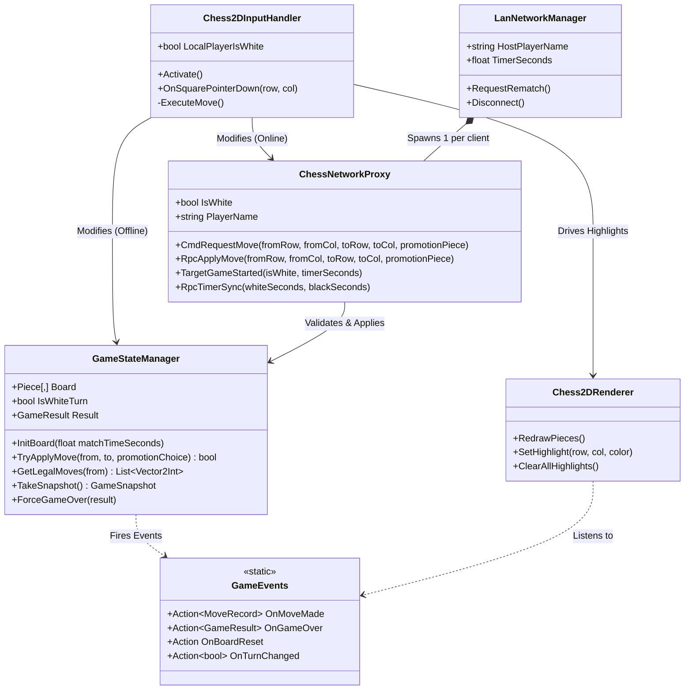

# Diagrame Arhitectura ARChess

Această diagramă exemplifică cum clasele importante interacționează între ele în acest proiect.

```mermaid
classDiagram
    class GameStateManager {
        +Piece[,] Board
        +bool IsWhiteTurn
        +GameResult Result
        +InitBoard(float matchTimeSeconds)
        +TryApplyMove(from, to, promotionChoice) bool
        +GetLegalMoves(from) List~Vector2Int~
        +TakeSnapshot() GameSnapshot
        +ForceGameOver(result)
    }

    class GameEvents {
        <<static>>
        +Action~MoveRecord~ OnMoveMade
        +Action~GameResult~ OnGameOver
        +Action OnBoardReset
        +Action~bool~ OnTurnChanged
    }

    class ChessNetworkProxy {
        +bool IsWhite
        +string PlayerName
        +CmdRequestMove(fromRow, fromCol, toRow, toCol, promotionPiece)
        +RpcApplyMove(fromRow, fromCol, toRow, toCol, promotionPiece)
        +TargetGameStarted(isWhite, timerSeconds)
        +RpcTimerSync(whiteSeconds, blackSeconds)
    }

    class Chess2DInputHandler {
        +bool LocalPlayerIsWhite
        +Activate()
        +OnSquarePointerDown(row, col)
        -ExecuteMove()
    }

    class Chess2DRenderer {
        +RedrawPieces()
        +SetHighlight(row, col, color)
        +ClearAllHighlights()
    }

    class LanNetworkManager {
        +string HostPlayerName
        +float TimerSeconds
        +RequestRematch()
        +Disconnect()
    }

    %% Relationships
    Chess2DInputHandler --> GameStateManager : Modifies (Offline)
    Chess2DInputHandler --> ChessNetworkProxy : Modifies (Online)
    ChessNetworkProxy --> GameStateManager : Validates & Applies
    GameStateManager ..> GameEvents : Fires Events
    Chess2DRenderer ..> GameEvents : Listens to
    Chess2DInputHandler --> Chess2DRenderer : Drives Highlights
    LanNetworkManager *-- ChessNetworkProxy : Spawns 1 per client
```
