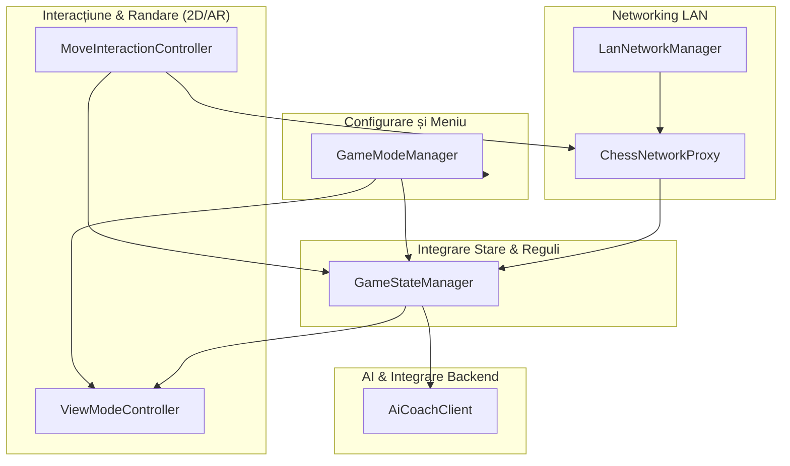
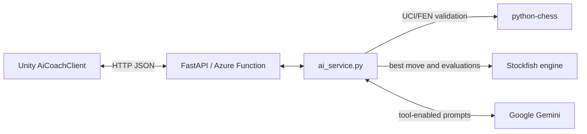
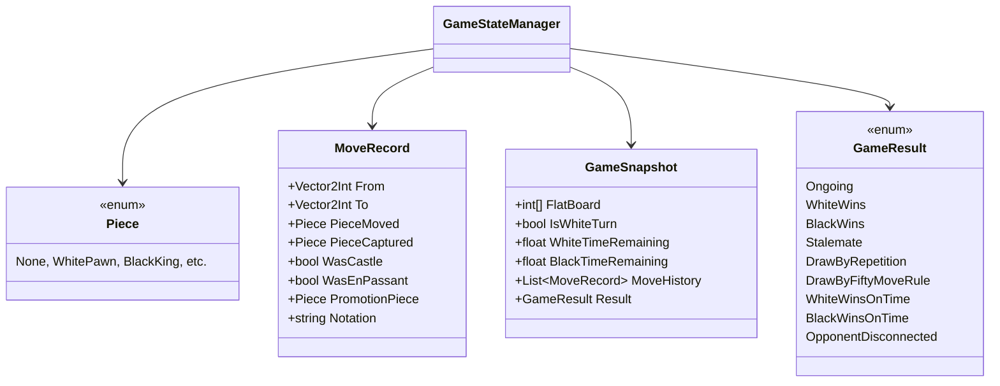
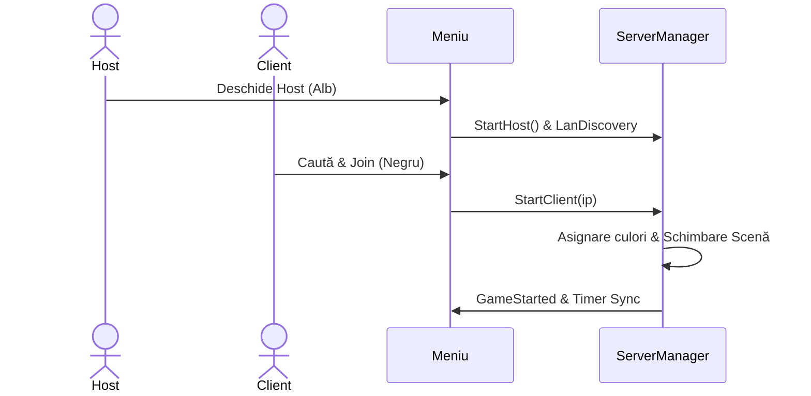
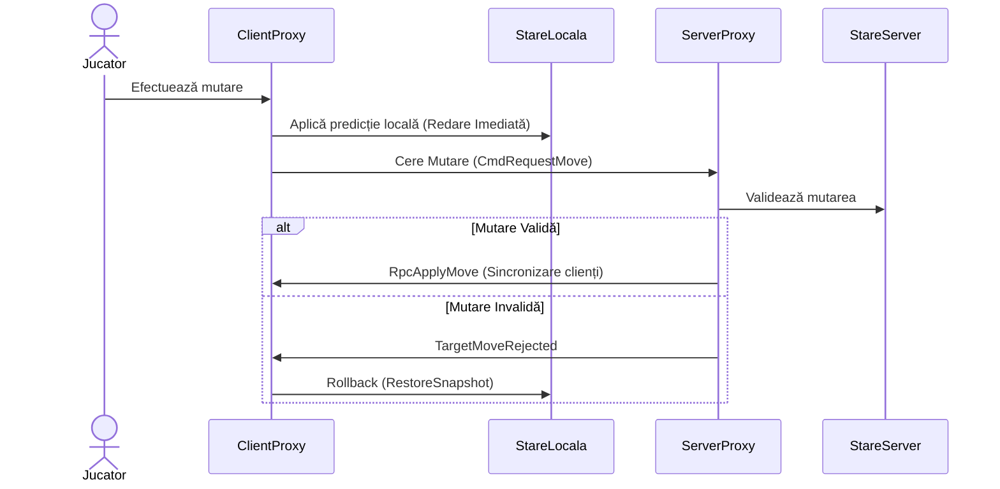

## 1. Arhitectura unui client

More or less MVC, MoveInteractionController e un Controller, GameStateManager e un Model, iar sistemul de rendering este View-ul.

## 2. Arhitectura Python AI Service

## 3. Schemele de Date

## 4. Secvențe Networking (Simplificate)

Flow-urile de rețea utilizează o arhitectură server-autoritativă prin Mirror Networking.

### 4.1. Conectare și Start Joc

### 4.2. Flux de Mutare (cu Predicție Locală)

