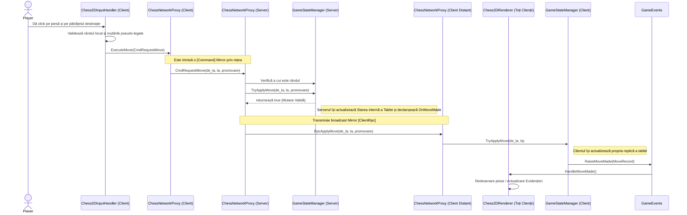

# Diagrama de Secvență a Rețelei AR Chess

Această diagramă de secvență detaliază fluxul efectuării unei mutări tipice în timpul unei sesiuni active de multiplayer prin LAN.

### Note privind Fluxul:
- **Server cu Autoritate**: Proxy-ul clientului trimite o intenție (`CmdRequestMove`) și se bazează pe server pentru a valida de fapt regulile prin `GameStateManager.TryApplyMove()`. 
- **Releu Rpc**: Odată verificat, serverul declanșează `RpcApplyMove` pe ceilalți clienți.
- **Interfață condusă de evenimente**: Odată ce o mutare este înregistrată fizic în `GameStateManager`-ul oricărei instanțe, aceasta lansează `GameEvents.OnMoveMade()`, determinând interfața vizuală locală (și procesatorii de date de intrare) să elimine logicile temporare și să se redeseneze.
