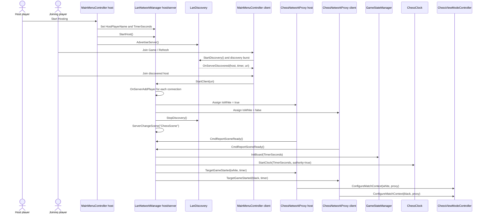
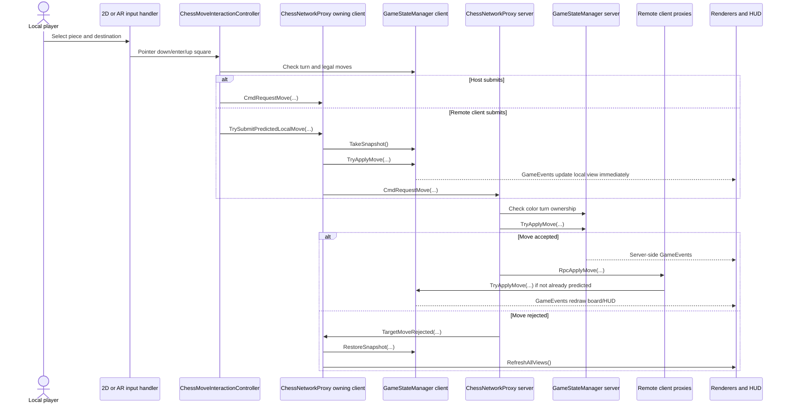

# LAN Network Sequences

The current LAN flow uses Mirror with a server-authoritative chess state. The host is always assigned white, the joining client is assigned black, and both clients report scene readiness before the match clock starts.

## Startup Sequence

## Move Sequence With Prediction

## Timer And Disconnect Notes

- `LanNetworkManager.Update()` sends `RpcTimerSync` from the authoritative host about every two seconds.
- LAN clients run `ChessClock` as non-authority and use server timer values for display.
- If a remote opponent disconnects during an active LAN match, `GameStateManager.ForceGameOver(GameResult.OpponentDisconnected)` ends the match.
- The host can request a rematch from `GameOverOverlay`; the server resets the board, restarts the authoritative clock, reapplies color assignments, and sends `TargetGameStarted` again.
